# Rock, Paper, Scissors

Rock, Paper Scissors is a digital game that leaves no chance of luck. The player has the option to pick either the Rock, Paper, or Scissors button. It is to be played against the computer, which randomly generates an answer from the three buttons dislayed on the screen. Paper beats rock, but loses to scissors. Rock beats scissors, but loses to Paper, and Scissors beats Paper, but loses to Rock. The winners score will increment by one and the game can then be played again. The first player to reach a score of three wins the round. 

The games desig is minimal to make it's usage appropriate for people of any age!

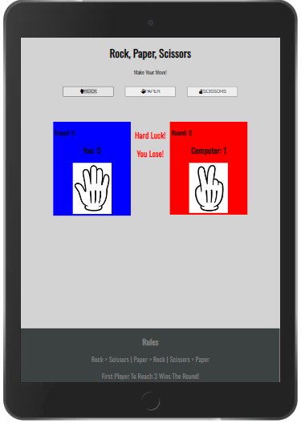

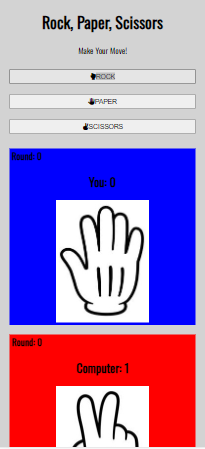
- Mobile Viewing
# Features 

 Header 
-
The header is found at the top of the page and clearly shows the title. The colour contrasts with the background and makes the lettering very easy to read.

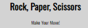

Buttons 
-

Underneath the header lies the three buttons, Rock, Paper and Scissors.  The user pics one button and then the game will run.

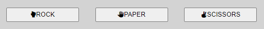

The Game Area 
-
Beneath, lies the game area. Once the player picks a button, javascript randomly geneates a random choice out of the three buttons. Whoever wins will have their score incremented by 1. And no party will have their score incremented if it is a draw.

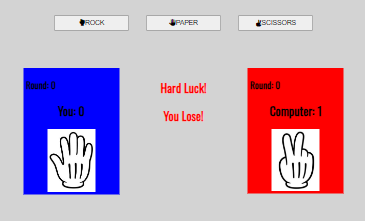

The Footer 
-
The footer lies at the very bottom of the page. There, you can find the rules in order to understand how the game works.

# Wireframes 
Sketching
-
I made a mock up game with pen and paper to roughly design the game.
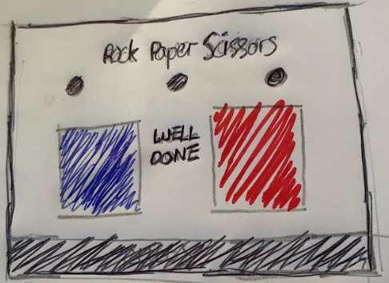

# Testing 

Devtools
-
Throughout this project I regularly used chrome devtools to inspect my work and see how the game functions. I used lighthouse to test the site acessability regularly unsuring it always maintaine high scores

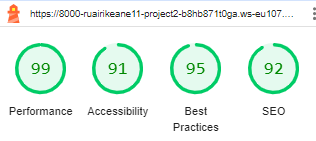

HTML Validation 
-
I used https://validator.w3.org/ to test my HTML content ensuring that there were no errors found in my 

CSS Validation 
-
I used https://jigsaw.w3.org/css-validator/ to test my CSS content and ensured that there were no errors found in my code.

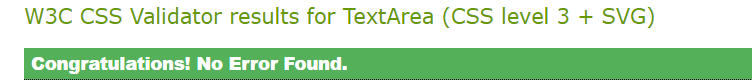

Javascript Validation 
-
I used https://jshint.com/ to test my javascript files to ensure all of my functions were running smooth. It had the following metrics.

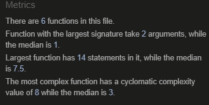

Manual Testing 
-
I sent the game to numerous friends and family members, many of whom have different mobile devices to ensure the game runs and looks optmimal on numerous screen sizes.

# Credits

- I used Matt Rudge's video (https://www.youtube.com/watch?v=apK6caj8bfI) as inspiration for my project. Specifically, I used the block of code demonstrated in his video to make the game run once a button is clicked.
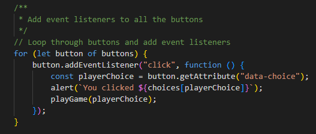

- I also used (https://chat.openai.com/c/0f2d1c66-09a6-468f-8e6e-a3f83c472b7f) throughout to debug. It was able to help me fix an issue I had in my code which was prevnting the computer choice being random. 
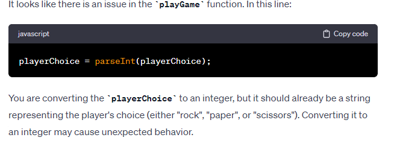 
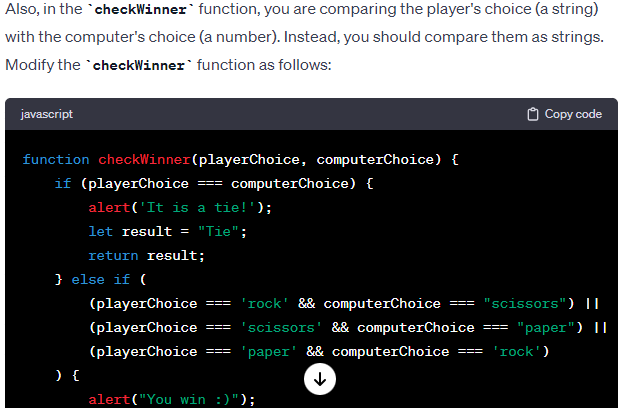

- I used one rock, paper and scissors image that I found on google images and then made it into three individual images. 
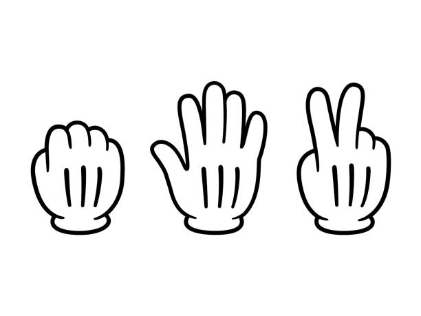

- I used (https://www.youtube.com/watch?v=apK6caj8bfI) as inspiration for my game design. I customised it to fit my own game design which was slightly different from the one displayed in the video.

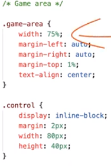

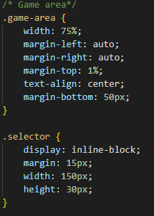

- I used the Oswald font from (https://fonts.google.com/) for the text in the body of the webpage. I also used (https://fontawesome.com/) for the icons in each button.

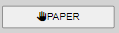

# Deployment 

- I used https://www.gitpod.io/ and deployed early to https://github.com/ very early on in the development of the project. This meant I could sent my website to my tutor, friends and family to test the project for bugs at every stage throughout the project.
- The steps to deploying the website are as followed 
  - In the github repository, go to the setting tab.
  - Select the Master Branch from the source section dropdown menu.
  - Now, the page should provide a completed link to the website.

