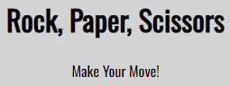
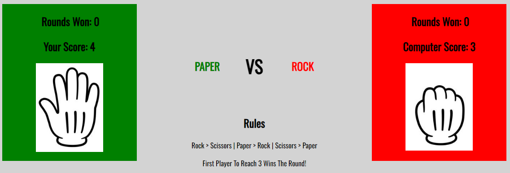
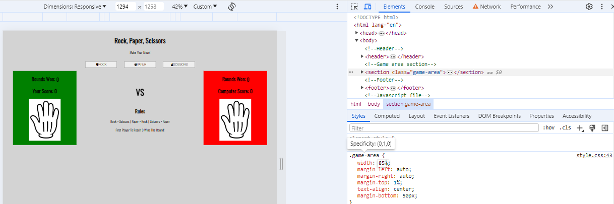
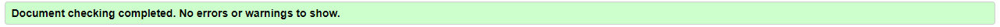

# Rock, Paper, Scissors

Rock, Paper Scissors is a digial, single player game. The player has the option to pick either the Rock, Paper, or Scissors button. It is to be played against the computer, which randomly generates an answer from the three buttons dislayed on the screen. Paper beats rock, but loses to scissors. Rock beats scissors, but loses to Paper, and Scissors beats Paper, but loses to Rock. The winners score will increment by one and the game can then be played again. The first player to reach a score of five wins the round. 

The games design is minimal and appropriate for people of any age!

 

## Table Of Contents 

1. [Features](#features)
2. [Wireframes](#wireframes)
3. [Testing](#testing)
4. [Credits](#credits)
5. [Deployment](#deployment)

# Features 

Header 
-
The header is found at the top of the page and clearly shows the title, 'Rock, Paper, Scissors'. The colour contrasts with the background and makes the lettering very easy to read. 

Buttons 
-
Underneath the header lies the three buttons, Rock, Paper and Scissors.  The user pics one button and then the game will run.

The Game Area 
-
Beneath the buttons lies the game area. Once the player picks a button, javascript randomly geneates a random choice out of the three buttons. Whoever wins will have their score incremented by 1. And no player will have their score incremented if it is a draw.

The Footer 
-
The footer lies below the game area. There, you can find the rules in order to understand how the game works. This will be visible for all users regardless of what screen they are viewing.

# Wireframes 
Sketching
-
I made a mock up game with pen and paper to roughly design the game. I thought this design would make the game easy to play and navigate through.

As you can see, my deployed version followed a similar design as the mock-up. Both have three buttons, two horizontal player boxes, and text in the centre to notify the player about the score etc.

# Testing 

Lighthouse
-
Throughout this project I regularly used the Google 'Lighthouse' feature to inspect my work and see how the game functions. I used lighthouse to test the site acessability and performance regularly unsuring it always maintained high scores.

Devtools
-
I regularly use Google Devtools to experiement with different styling before adding the code to my workspace. This meant it was easy to test certain aspects of the game design without having to actually implement it in my IDE.

Desktop Testing
-
I reguarly used Devtools to see what the game would look like on different screen sizes. I also sent the deployed site to family with different sized laptops, they then gave me feedback regarding the games usability. After feedback I would make the required changes to optimise the user experience. I tested the site on browsers such as Chrome, Firefox and Safari ensuring that it ran smooth on all browsers.

Mobile Testing
- 
I often opened the deployed website in my Iphone XR during the production to see how the game functioned. I also sent the website to multiple friends, all of whom used different screen sizes while playing the game. I was also able to test several other mobile screen sizes on Devtools.

HTML Validation 
-
I used https://validator.w3.org/ to test the index.html content ensuring that there were no errors found.

CSS Validation 
-
I used https://jigsaw.w3.org/css-validator/ to test my CSS content and ensured that there were no errors found in my code.

Javascript Validation 
-
I used https://jshint.com/ to test my javascript files to ensure all of my functions were running smooth.

Bugs 
- 
When I deloyed the site, I found that the game area had bugs, specifically, on certain screens the text would be covered by the red and green boxes. To fix this issue, I created two media queries to ensure the text would be clearly visible on all screen sizes.

# Credits

### Love Maths Walkthrough Project - Anna Greaves

I found the 'Love Maths' walkthrough project very helpful. Completing this walkthrough made me familiar with the javascript language and combining javascript, HTML and CSS styling to interact with each other.

# Deployment 

I used https://www.gitpod.io/ and deployed early to https://github.com/ very early on in the development of the project. This meant I could sent my website to my tutor, friends and family to test the project for bugs at every stage throughout the project.

The steps to deploying the website are as follows :
 - In the github repository, go to the setting tab.
 - Select the Master Branch from the source section dropdown menu.
 - Now, the page should provide a completed link to the website.

